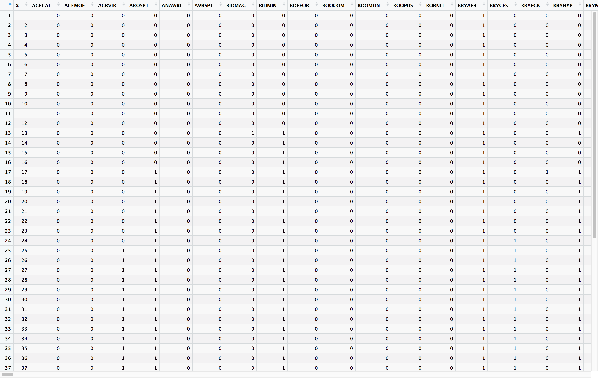
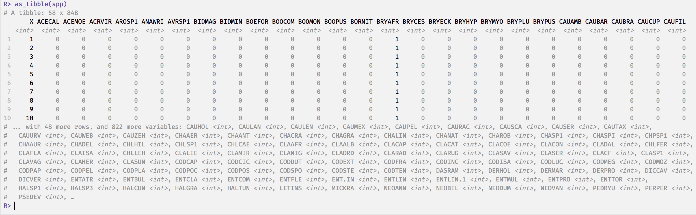
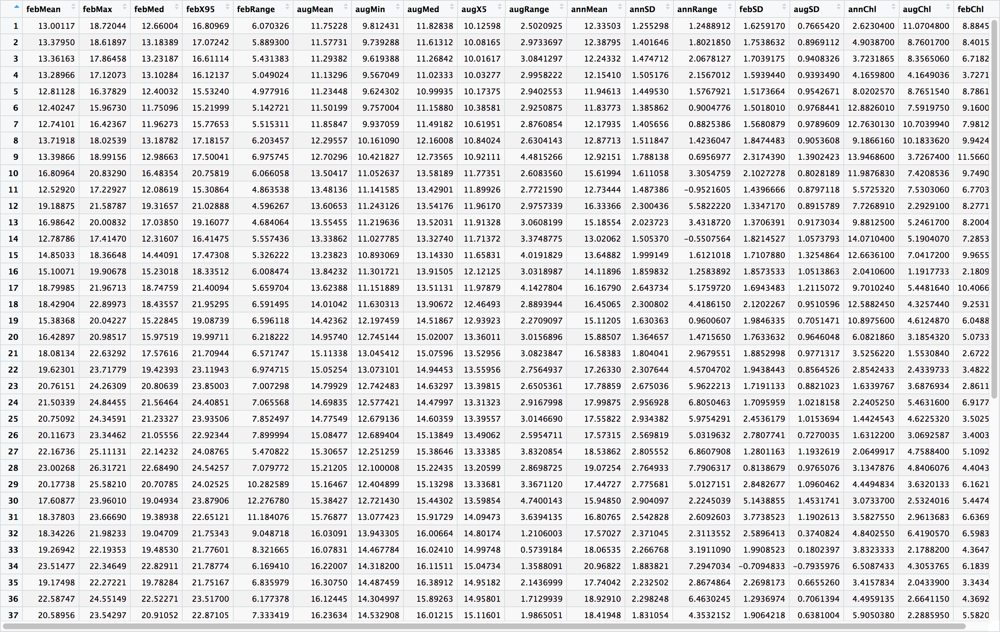
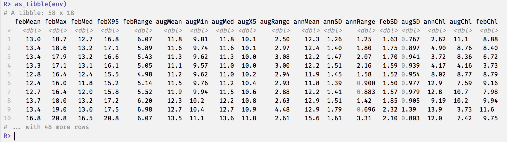

# Ecological data

> *“The great challenge of the twenty-first century is to raise people everywhere to a decent standard of living while preserving as much of the rest of life as possible.”*
>
> --- Edward O. Wilson

## Properties of the data sets
Ecological data sets are usually arrange in a *matrix*, which **has species (or higher level taxa, whose resolution depends on the research question at hand) arranged as columns** and **samples (typically the sites, stations, transects, time, plots, etc.) as rows**. We call this a **sites × species** table. In the case of environmental data it will of course be a **sites × environment** table. The term 'sample' may be applied differently compared to how we used it in the [Basic Statistics Workshop](https://robwschlegel.github.io/Intro_R_Workshop/); here we use it to denote the basic unit of observation. Samples may be quadrats, transects, stations, sites, traps, seine net tows, trawls, grids cells on a map, etc. It is important to clearly and unambiguously define the basic unit of the sample in the paper's Methods section.

Example species and environmental data sets are displayed below in Figures 2.1-2.4. The species matrix here comprises distribution records of 846 macroalgal species within each of 58 × 50 km-long sections along South Africa's coastline. So, the matrix has 58 rows, one for each sample (here each of the coastal sections), and 846 columns, one for each of the seaweed species found in South Africa. Some of the coastal sections do not have a species present and it will simply be coded as 0 (for not present in the case of presence/absence data, or 0 units of biomass or abundance, etc.). The matching environmental data set has information about various measurements of seawater temperature and chlorophyll-*a* content --- their names are along the columns, and there are 18 of them. It is important that a sample of the environment is available for each of the seaweed samples, so there will also be 58 rows present in this data set. So, it is a matching data set in the sense that each sample of species data is matched by a sample of the environment (both have 58 rows). Using this data set, it was the intention of Smit et al. (2017) to describe the gradients in seaweed distribution as a function of the underlying seawater temperatures.

(\#fig:species_table)The table (or spreadsheet) view of the species data. Note the species codes appearing as column headers; numbered from 1 through to 58 (row 58 is at the bottom of the table, so you'd have to scroll down to see it) at the bottom of the table are each of the samples --- in this case, there is one sample per station.

(\#fig:species_tibble)This is a tibble printout of the same species data we saw in Figure 2.1.

(\#fig:environment_table)The table view of the environmental data. The names of the environmental variables appear as column headers, and numbered from 1 through to 58 at the bottom of the table are each of the samples --- the samples are defined as per Figure 2.1.

(\#fig:environment_tibble)A tibble printout of the same environmental data we saw in Figure 2.3.

Species data may be recorded as various kinds of measurements, such as presence/absence data, biomass, or abundance. 'Presence/absence' of species simply tells us the the species is there or is not there. It is binary. 'Abundance' generally refers to the number of individuals per unit of area or volume, or to percent cover. 'Biomass' refers to the mass of the species per unit of area or volume. The type of measure will depend on the taxa and the questions under consideration. The important thing to note is that all species have to be homogeneous in terms of the metric used (i.e. all of it as presence/absence, or abundance, or biomass, not mixtures of them). The matrix’s constituent row vectors are considered the species composition for the corresponding sample (i.e. a row runs across multiple columns, and this tells us that the sample is comprised of all the species whose names are given by the column titles --- note that in the case of the data in Figure 2.1-2.2, it is often the case that there are 0s, meaning that not all species are present at some sites). Species composition is frequently expressed in terms of relative abundance; i.e. constrained to a constant total such as 1 or 100%. The environmental data may be heterogenous, i.e. the units of measure may differ among the variables. For example, pH has no units, concentration of some nutrient has a unit of (typically) μM, elevation may be in meters, etc. Because these units differ so much, and because they therefore have different magnitudes and ranges, we may need to standarise them. The purpose of multivariate analysis is to find patterns in these complex sets of data, and to explain why these patterns are present.

Many community data matrices share some general characteristics:

* Most species occur only infrequently. The majority of species is typically represented at only a few locations, and these species contribute little to the overall abundance. This results in sparse matrices, as we see in Figures 2.1-2.2, where the bulk of the entries consists of zeros.

* Ecologists tend to sample a multitude of factors that they think influence species composition, so the matching environmental data set will also have multiple (10s) of columns that will be assessed in various hypotheses about the drivers of species patterning across the landscape. For example, fynbos biomass may be influenced by the fire regime, elevation, aspect, soil moisture, soil chemistry, edaphic features, etc.

* Even though we may capture a multitude of information about many environmental factors, the number of important ones is generally quite low --- i.e. a few factors can explain the majority of the explainable variation, and it is our intention to find out which of them is most important.

* Much of the signal may be spurious. Variability is a general characteristic of the data, and this may result in false patterns emerging. This is so because our sampling may capture a huge amount of stochasticity (processes that are entirely non-deterministic), which may mask the real pattern of interest. Imaginative and creative sampling may reveal some of the patterns we are after, but this requires long years of experience and is not something that can easily be taught as part of our module.

* There is a huge amount of collinearity. Basically, what this means is that although it is often the case that many explanatory variables are able to explain patterning, only a few of them act in a way that implies causation. Colinearity is something we will return to later on.

## Field sampling
## Historical data
## Remotely sensed data
## Modelled data (projections)
